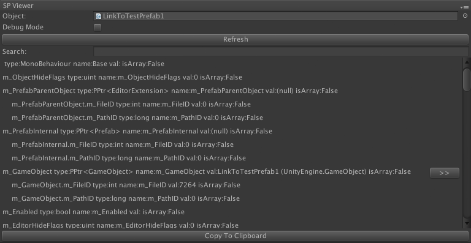

# Serialized Property Viewer

This is a utility window for Unity3D that exposes the [SerializedProperties](http://docs.unity3d.com/ScriptReference/SerializedProperty.html) of an object. 

## Why Would I Use This Thing?

Have you ever needed to know exactly how Unity serializes your game object/behaviour/thing? Maybe you need to create an Editor in Unity but having trouble figuring out how the data is exposed? Maybe you want to see how Unity serializes its own internal objects? If you're doing something in the Editor, you need to see it how the Editor sees it. Which is NOT intuitive. Hence the SerializedPropertyViewer.

Usage is quite straightforward: drag an object into the `Object` field and observe the output. This is unfiltered so expect lots of info. For example, char* are displayed as arrays, and object references are shown as a PPtr<TYPE> (which contains two values: m_FileID, and m_PathID).

## Features
  
  * Displays everything how Unity sees it.
  * 'Debug Mode' turns on the 'm_LocalIdentfierInFile' hack to get access to the m_InstanceID.
  * Search field that will highlight in green the string entered.
  * When an object is found a 'goto' button is displayed.
  * Displays the propertyPath, which you can use as input to [FindProperty()](http://docs.unity3d.com/ScriptReference/SerializedObject.FindProperty.html)

